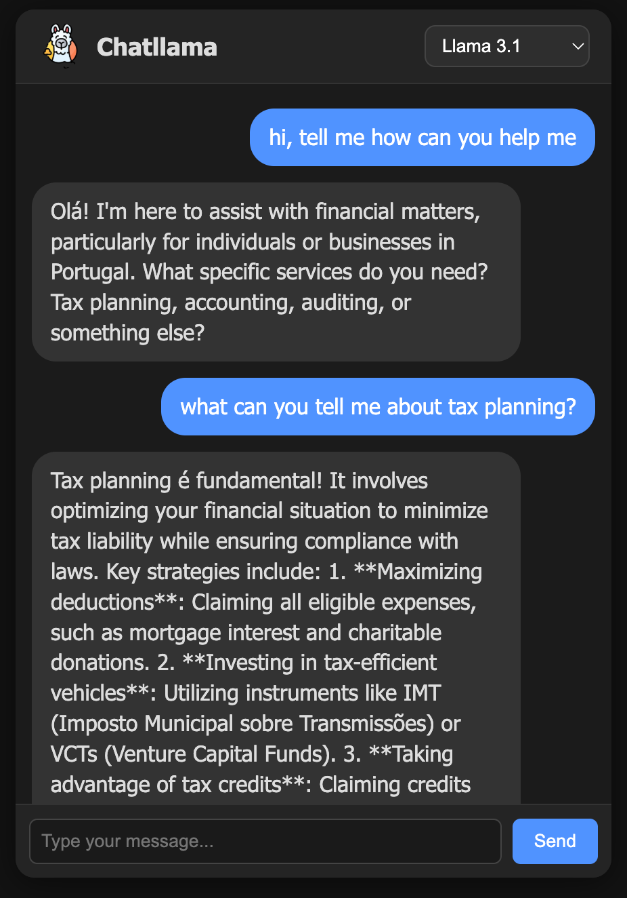

# Chatllama - A chatbot using Ollama models

## Setup

1. You will need to download and install Ollama - Download: https://ollama.com/download
2. Install models on Ollama `ollama pull <model>`
    - Models used: `deepseek-r1:8b` , `llama3.1`
3. Run ollama model: `ollama run llama3.1`
4. Run API: `./gradlew bootRun`
5. Run React APP: `cd chatbot-ui && npm install && npm start`

## Examples
- Chatllama is set up to talk about software development topics by default.
This can be changed in `application.yml` on property `chatbot.system.message`.

    
    

